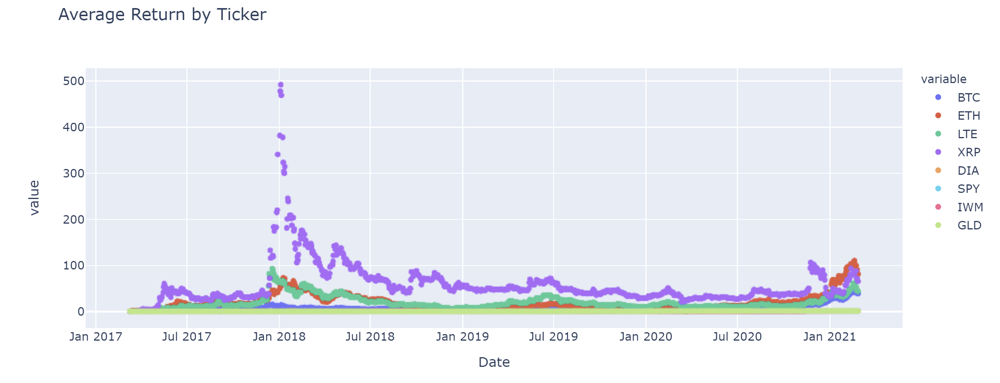
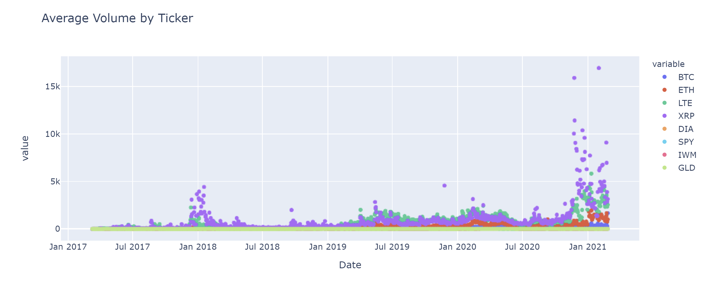
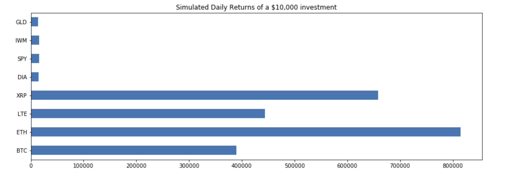
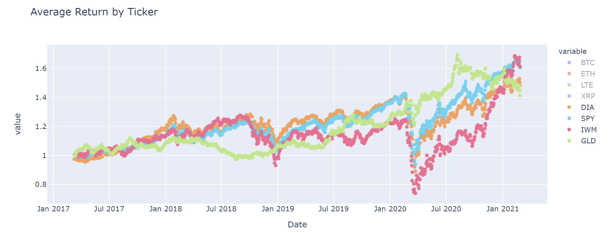
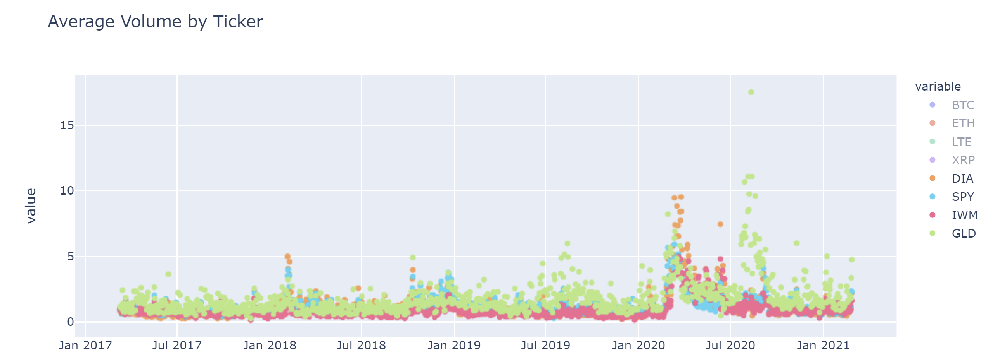
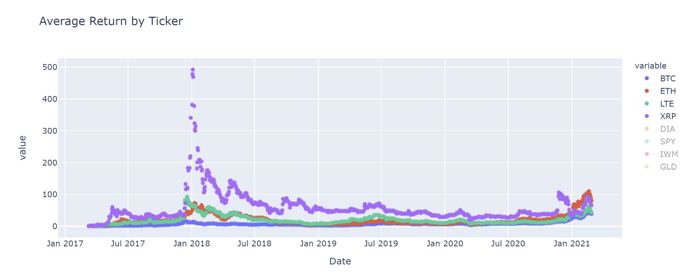
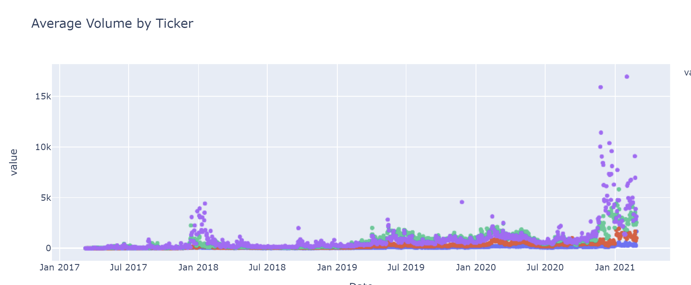
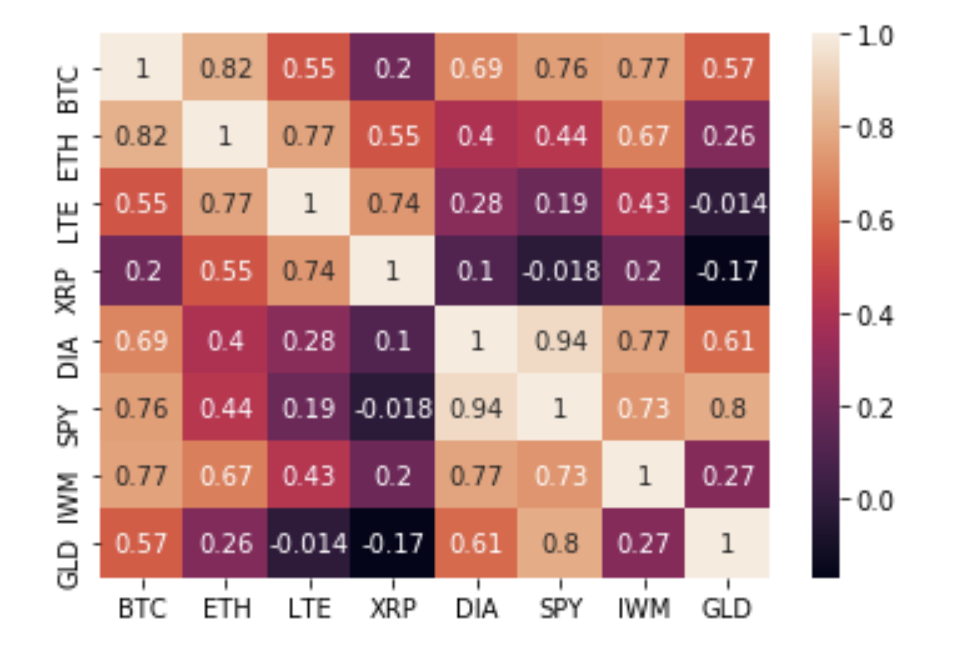
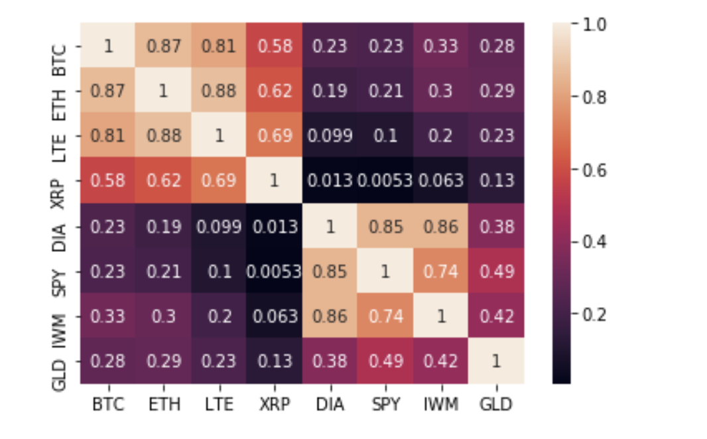

# Project-1

## By: Eric Linn, Lou Donofrio, and Chris Tarker

## Title: Crypto Analysis

## Project Description/ Outline: What moves Crypto Market?

## Questions to answer:

## Question 1 - How does volume relate to cryptocurrency and what can it tell us about price movements? (Lou)
  Volume can affect price in a number of ways. For starters the greater the trading volume of an asset the greater its liquidity. This means that it is easier for traders to buy and sell at favorable prices and the more people trade the more likely it is the the assets price will change. 
### Price by Volume for Crypto Currencies:
  From these graphs we are able to see a pattern where spikes in volume lead to spikes in pricing.

  
### Correlations for Price and Volume:
  This correlation map depicts crypto trading volume and closing prices. From this graph we are able to determine that Bitcoin has the strongest correlation between its volume and pricing. 

 
 This correlation map depicts crypto prices and trading volumes where the volume is lagging 0-5 days behind. From this map we can see that volume is most strongly correlated to price the day of or the day prior to price. This shows us that crypto volume could be an indicator of price movement but it is not conclusive. 
     
      BTC Corr  0 = .77  -1 = .77  -2 = .77   -3 = .77   -4 = .78   -5 = .78   -6 = .77
      ETH Corr  0 = .57  -1 = .57  -2 = .56   -3 = .55   -4 = .55   -5 = .54   -6 = .53
      LTC Corr  0 = .42  -1 = .41  -2 = .40   -3 = .39   -4 = .38   -5 = .38   -6 = .37
      XRP Corr  0 = .28  -1 = .27  -2 = .25   -3 = .25   -4 = .24   -5 = .24   -6 = .23

### Volume and Price by Month:
  This graph depicts the the average volume by month over a 5 year span. We can see that volume begins to rise during October/November and peaks in February. 

  This graph depicts the average price by month over a 5 year span. It closly follows the same pattern as the previous volume graph. 

### Conclusion: 
  From this we are able to see that volume and pricing for cryptocurency are correlated. We are also able to see that Bitcoin has the highest correlation of the crypto currencies we looked at and that it most often sees spikes in price and volume towards the end of the year. From this data we can interpret that the best time to buy Bitcoin is towards the end of the year when volume spikes and the best time to sell is after February when volume drops. 

## Question 2 - What creates volatility in the crypto market and how they move in tandem? Are any of the selected coins undervalued, overvalued? (Chris)

In any instance when we are talking about crypto currencies, we cannot talk about them without mentioning the volatility of the market.  But that is something that everyone can say when talking about cryptocurrencies.  So, going in a different direction at first, I wanted to see, out of the 4 coins we researched, which on is undervalued the most.

                                                  Bitcoin

Ethereum

Litecoin

XRP

Basically, Bitcoin and Ethereum both have a high market cap and a higher valuation.  And when looking at XRP, we see a high market cap, but a low value for each coin.  However, when we examine the Volume to Market Cap ratio for Litecoin, it is very high.  This just means that Litecoin is a very undervalued coin when comparing it to the others.

Now, we can use the Pearson Correlation graph to show just how close each one of these coins open and closing prices are aligned.
 Bitcoin

                                    Ethereum

                                    Litecoin

                                    XRP

## Question 3 - Crypto vs stocks: Volume and Returns - Do they correlate? (Eric)

Cyptocurrency vs. the stock market is an interesting topic and one that is quickly becoming mainstream news. We found this topic intriguing, does the stock market and crypto currency correlate? If so, how do they correlate? We decided to put our hypothesis to the test by looking at 4 of the largest ETF indexes (SPY – S&P 500, DIA – Dow Jones Industrial Average, IWM – Russell 2000, GLD – Gold) and 4 of the most prevalent cryptocurrencies (BTC – Bitcoin, ETH – Ethereum, LTE – Litecoin, and XRP – Ripple) and comparing their average returns and the trading volume over the last 5 years. 

We started by pulling crypto data from Kaggle.com and stock market data from Alpaca. From there we sifted through the data to calculate the average return, average volume and correlation of these assets. Our findings were conclusive, but still left you scratching your head. 

As depicted in the below graphs you can see that cryptocurrencies on average significantly outperformed the overall stock market during the 5 year period. Crypto currency cumulatively averaged ten times what the stock market returned, 576% and 52%, respectively.

The part we found interesting was comparing the average return to the  average volume available. Stock market returns tended to lag as volume rose and the crypto market was a complete 180, in that when the asset prices rose, so did the volume. This begs the question – Why do they move in opposite directions?

In order to compare the two asset classes even further, we calculated the correlation. Our findings we relatively static in that crypto currencies were a complete 180 to the stock market in how they move. One interesting thing to note, is that Bitcoin actually traded more like a stock than any other crypto currency and almost identical to GLD. This is something we would like to dive deeper into in future projects.

## Conclusion:

We concluded that the stock market does not move in correlation with the crypto markets in terms of volume and returns.

### What problems arose?

The biggest struggle I faced was with plotting the data with different subsets and scales. IE. Volume (MM) and Return (hundreds).

### What would we add/ do differently is granted more time? 

### Any major takeaways?

If granted more time I would like to dive deeper into the relationship with BTC/GLD and why the other crypto currencies move asymmetrically in comparison.
